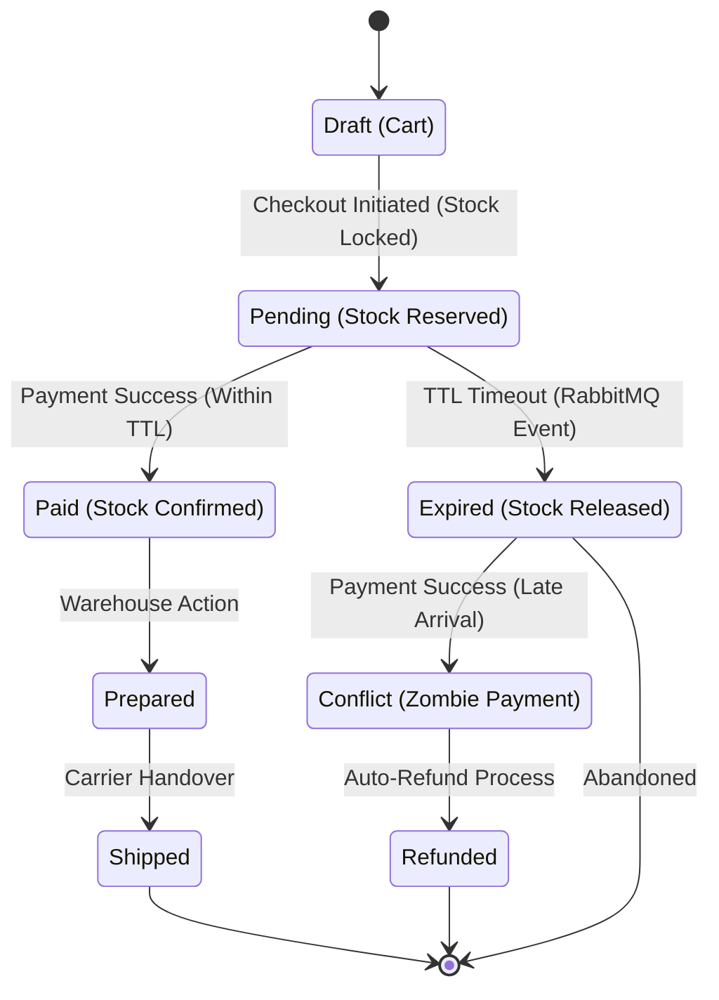

# Journal du projet

## Phase : Exploration

### P1 - Choix de la stack et clarification des contraintes

**Prompt :**
> Hello there. We're going to start a project by using the wardley map method. The red chain and the blue chain. With the red one, we're going to chat and don't generate any code of this project. The only modification you'll need to do during this phase are in the PROMPTS.md file with the example in the DRAFT.md file. For now, we're not in any phase. I want you to suggest me three stacks with pros, cons, testability, or any criteria interesting to keep in mind. Knowing that for the front part, I am a good beginer with vue.js, and sometimes I use vanilla js instead of vue. For the back, I started PHP and Symfony, but I'm more confortable with js for back (I sometimes used Node, or Express). If you need more informations to search and compare, ask me before. Every time I ask you something. update the PROMPTS.md file with the example in the DRAFT.md file. And for this request, I will need you to update the "Stack" part of the DRAFT file when we'll choose the entire stack. I also have one question, what do you think about the third constraint "Un paiement peut être validé après expiration du stock réservé". If I understand clearly, even if the stock is not reserved, you can valid a payment. But is it not in opposition with the second constraint (Le stock doit être réservé atomiquement (pas de survente)) ? I think I misunderstand something, so if you think so, explain me this constraint please

**Résumé de la réponse :**
Explication de la contrainte "Paiement après expiration" comme étant un cas limite (race condition) et non une contradiction. Proposition de 3 stacks : MEVN (Express), NestJS (Structuré), et Fastify (Performance). Recommandation de NestJS pour l'aspect "micro-outils" ou Express pour la familiarité.

**Décision :**
À définir (Choix de la stack en attente).

## Phase : Décision

### P2 - Définition de la stack, des invariants, du périmètre et des critères de succès

**Prompt :**
> Step by step I will add sometimes rules to write markdown. This time I add one in the DRAFT file, so you can update the 1st prompt part and also follow all rules for this 2nd prompt. For the choice, to be able to understand what you're going to generate. We'll choose the option A. So you can update the DRAFT file and its Stack part. And we can start by listing all critical invariables for our future app. In a second step I would love to hear with the informations we have in the DRAFT.md file, what is our exact perimeter. And the third step of this request is to identify the success criteria. This is the Decision phase, to clarify the intention. Don't forget to update the PROMPTS.md file with the DRAFT rules.

**Résumé de la réponse :**
Validation de la stack Option A (Vue/Express/Prisma). Identification des invariants critiques (stock atomique, intégrité des états), du périmètre (panier à expédition + relance) et des critères de succès (gestion des race conditions, modularité).

**Décision :**
Stack validée : Vue.js + Express + PostgreSQL/Prisma. Périmètre et invariants définis pour la suite.

### P3 - Correction Markdown, Clarification Relance et Complétion Critères

**Prompt :**
> You don't follow the MD012 rule and MD041 rule, I added the MARKDOWN_RULES.md file for you to know what you missed and to avoid the add of rule in the DRAFT.md file. You can suppress the part about markdown rules in the DRAFT file, and follow the MARDOWN_RULES file in context. What do you mean by "Recovery: Detecting abandoned carts (older than 24h) and simulating a recovery action (logs/email mock).". For me when in the exercice subject, it says "relancer les paniers après 24h". I understand that we need to reach the user in a way or another to make him/her conclude the order. And you, what did you mean? I'm telling you that you need to update the PROMPTS.md file another time, but tell me if you don't need me to do it from now. For the first line of the markdown file, we need a 1st level header, put the best title for this PROMPTS.md file please. For the response about the invariables, perimeter, and success criteria: I agree with all of your thoughts. But have we really all of the success criteria the base subject implies? If yes, we're good, and we can move to the next step. If no, don't hesitate to write it into the next response please

**Résumé de la réponse :**
Correction des règles MD (MD012, MD041). Clarification sur la "Relance panier" (Mock email). Ajout de critères de succès manquants (Calcul des promos, Machine à états stricte).

**Décision :**
Mise à jour des fichiers pour conformité MD. Validation des critères de succès étendus.

## Phase : Hypothesis

### P4 - Formulation des hypothèses

**Prompt :**
> I remove the update of PROMPTS file for the correction, it is not relevant. But thank you for doing it. Next step: can you help me and formulate 15 hypothesis about the architecture et the behavior of our future app please. I'll choose in this list and we'll keep 5. We have the obligation to cover these subjects with our hypothesis : "Réservation de stock
> Gestion des promotions
> Transitions d'état
> Centralisation du calcul du total
> Expiration des réservations". It's the Hypothesis Drive phase if I'm correct.

**Résumé de la réponse :**
Proposition de 15 hypothèses techniques réparties sur 5 thèmes (Réservation de stock, Promotions, Transitions d'état, Calcul du total, Expiration des réservations) avec différentes approches (ex: optimistic vs pessimistic locking, state machine vs service logic, cron vs message queue).

**Décision :**
En attente de la sélection des 5 hypothèses à retenir.

### P5 - Validation des hypothèses et Résumé de l'architecture

**Prompt :**
> For the stock reservation, I want us to keep the 2nd one optimism lock. For the promotion management, I choose the PromotionService with the 4th hypothesis. For the state transition, I love the Xstate library and its hypothesis. For the Total cart sum: I want us to use the event sourcing hypothesis. And for the reservation expiration with the stock. I would like to use RabbitMQ and consumer. For the next request: could you please do a summary of every architecture we explore, for the stack, and for the hypothesis, and every other subjects we covered. I want you for this request to write the choices we made clearly in the PROMPTS file, and with a reason. You don't have to do a summary of the response you'll give me this time but you have to write it entirely without reduce the size of the response you want to give at first

**Réponse complète (Résumé de l'architecture) :**
Voici le récapitulatif complet des choix architecturaux et techniques validés pour le projet :

#### 1. Stack Technique

* **Frontend :** Vue.js (via Vite). *Raison :* Confort de développement et performance.
* **Backend :** Express.js. *Raison :* Flexibilité et écosystème riche, structuré en "micro-outils".
* **Base de données :** PostgreSQL avec Prisma ORM. *Raison :* Robustesse relationnelle et typage fort.
* **Infrastructure additionnelle :** RabbitMQ. *Raison :* Nécessaire pour la gestion asynchrone des expirations (Hypothèse 14).

#### 2. Invariants et Périmètre

* **Périmètre :** Gestion de panier, Tunnel d'achat, Simulation paiement, Gestion des commandes, Relance panier abandonné.
* **Invariants Critiques :**
  * Atomicité du stock (pas de survente).
  * Cohérence des états de commande (Machine à états).
  * Exclusivité des promotions incompatibles.
  * Expiration stricte des réservations (TTL).

#### 3. Hypothèses d'Implémentation Validées

* **Réservation de Stock : Verrouillage Optimiste (Hypothèse 2)**
  * *Choix :* Utilisation d'une colonne de versioning.
  * *Raison :* Meilleure performance que le verrouillage pessimiste sur fort trafic, géré nativement par Prisma.
* **Gestion des Promotions : Service Centralisé (Hypothèse 4)**
  * *Choix :* `PromotionService` dédié.
  * *Raison :* Isole la complexité des règles métiers (incompatibilités) du reste de l'application.
* **Transitions d'État : XState (Hypothèse 7)**
  * *Choix :* Librairie de machine à états finis.
  * *Raison :* Garantit mathématiquement que les transitions invalides (ex: expédier sans payer) sont impossibles.
* **Calcul du Total : Event Sourcing (Hypothèse 12)**
  * *Choix :* Reconstruction du total via l'historique des événements (`item_added`, `promo_applied`).
  * *Raison :* Traçabilité totale et débogage facilité des erreurs de calcul.
* **Expiration des Réservations : RabbitMQ & Consumers (Hypothèse 14)**
  * *Choix :* Messages retardés (Delayed Exchange).
  * *Raison :* Plus précis et scalable qu'un Cron job pour libérer le stock exactement à la fin du TTL.

**Décision :**
L'architecture est figée. Intégration de RabbitMQ à la stack et adoption du pattern Event Sourcing pour le panier.

## Phase : Analyse des Risques

### P6 - Identification des limites et scénarios de rupture

**Prompt :**
> I didn't keep everything, like the P7 for correcting, it's not relevant for the diary. Now we have a model, a perimeter, invariables, constraints..., I want you to reveal me the limits if you can find limits we didn't take in account before. Is there any possible breaks in out logic, or problematic scenarios we didn't imagine

**Résumé de la réponse :**
Identification de 5 risques majeurs non couverts :

1. Problème de "Dual Write" (Incohérence DB vs RabbitMQ).
2. Versioning des règles métier avec l'Event Sourcing (changement de prix rétroactif).
3. Concurrence sur les limites globales de promotions (Race condition).
4. Paiement "Zombie" (Succès après réattribution du stock).
5. Idempotence nécessaire des consommateurs RabbitMQ (risque de regonfler le stock).

**Décision :**
Prise en compte des limites. Nécessité de prévoir des mécanismes de mitigation (Idempotence, Outbox pattern ou transactionnel, Versioning des events).

### P7 - Propositions de solutions pour les limites identifiées

**Prompt :**
> Could you correct this error in l111 "MD032/blanks-around-lists: Lists should be surrounded by blank lines" and change the number of certain "P" because we have missed one, the 4. For the 5 limits, expose me multiple solutions to manage these cases please. We'll chose what to do after propositions.

**Résumé de la réponse :**
Correction du formatage (MD032) et renumérotation des prompts (P5->P4, etc.). Proposition de stratégies pour les 5 limites :

1. Dual Write : Outbox Pattern vs Réconciliation.
2. Versioning : Snapshot des prix dans l'event vs Versioning des règles.
3. Concurrence Promo : Compteur Redis vs Verrou DB.
4. Zombie Payment : Remboursement auto (État Conflit) vs Extension TTL.
5. Idempotence : Vérification d'état vs Table de déduplication.

**Décision :**
En attente du choix des stratégies de mitigation.

### P8 - Choix des stratégies de mitigation et Ajout de Redis

**Prompt :**
> For the first and second risk, I agree with your recommended options. Also for the 4th and 5th risk, recommended option are good. But for the global promo limits I think even if the solution is hard, the best is the option A. Tell me which options is the most suitable.

**Résumé de la réponse :**
Confirmation des choix :

1. Dual Write -> Outbox Pattern.
2. Versioning -> Snapshotting des valeurs.
3. Concurrence Promo -> Redis Atomic Counter (Option A).
4. Zombie Payment -> Auto-Refund (État Conflit).
5. Idempotence -> Vérification d'état.

**Décision :**
Stratégies validées. Ajout de Redis à la stack technique pour gérer les compteurs atomiques.

## Phase : Moldable Development

### P9 - Modélisation de la Machine à États (ATM SMD)

**Prompt :**
> We enter in the moldable development phase, we want to test the logic without coding. could you please generate in text a diagram of the state machine (ATM SMD). We need to verify that every transitions are covered and every invalid transitions are explicitly forbidden. For this Prompt, I want you to update the PROMPTS file with every inch of your response. You don't have to reduce its size. It's important to see everything

**Réponse complète :**
Here is the complete State Machine Diagram (SMD) and the logic analysis for the "Moldable Development" phase.

#### 1. State Machine Diagram (Mermaid)

#### 2. Transition Logic & Guards

*   **Draft → Pending**
    *   *Trigger:* User clicks "Checkout".
    *   *Logic:* Optimistic Stock Reservation (DB Versioning) + Emit "Timer Started" event (Outbox).
    *   *Guard:* `Stock > 0`.
*   **Pending → Paid**
    *   *Trigger:* Payment Provider Webhook (Success).
    *   *Logic:* Mark Order Paid.
    *   *Invariant:* Stock is considered permanently deducted.
*   **Pending → Expired**
    *   *Trigger:* RabbitMQ Delayed Message Consumer.
    *   *Logic:* Release Stock (Increment DB).
    *   *Guard:* Order is still `Pending`. (If `Paid`, ignore message).
*   **Expired → Conflict (The "Zombie" Case)**
    *   *Trigger:* Payment Provider Webhook (Success).
    *   *Logic:* Money is received, but stock is gone. Transition to `Conflict` to flag for resolution.
    *   *Invariant:* Cannot go to `Paid` because stock is no longer held.
*   **Conflict → Refunded**
    *   *Trigger:* Automatic System Process (or Admin Action).
    *   *Logic:* Issue Refund via Payment Gateway.

#### 3. Explicitly Forbidden Transitions (Safety Checks)

To ensure system integrity, the XState machine must explicitly block these paths:

*   **Draft → Paid**: *Security Risk.* Attempting to pay without reserving stock.
*   **Pending → Shipped**: *Process Violation.* Skipping Payment and Preparation steps.
*   **Paid → Expired**: *Consistency Risk.* A late RabbitMQ message must NOT release stock for a paid order. The consumer must check `if (state === 'Pending')`.
*   **Expired → Paid**: *Inventory Risk.* Accepting an order when stock has been released to someone else. Must go to `Conflict`.

**Décision :**
The State Machine model is validated. It covers the nominal flow, the expiration flow, and the critical "Zombie Payment" edge case via the `Conflict` state.
