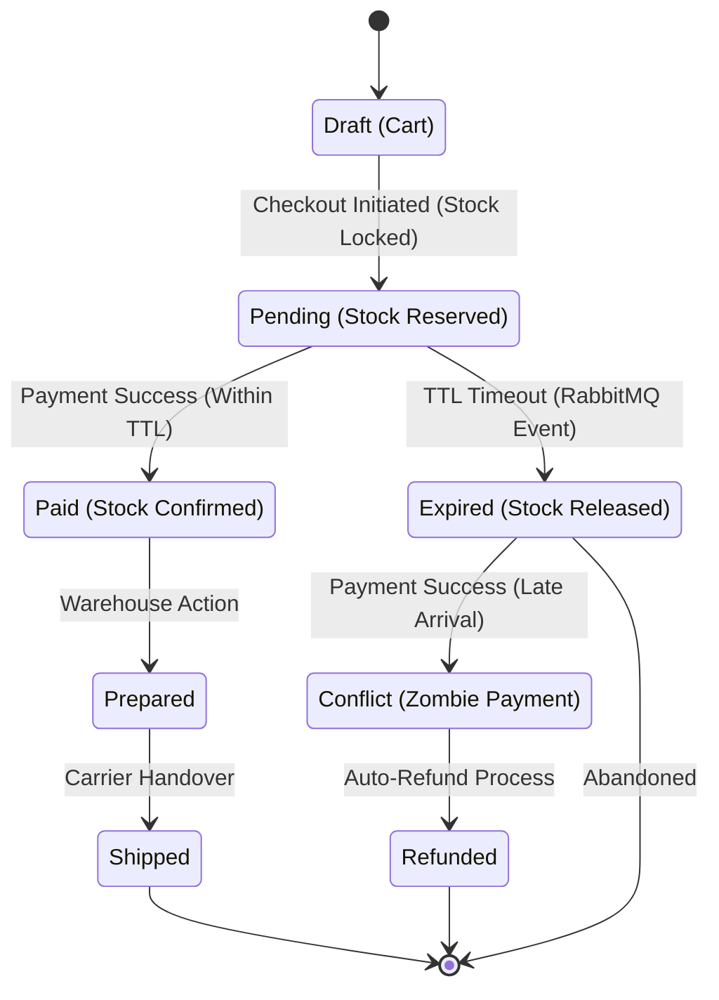

# Journal du projet

## Red Chain

### Phase : Décision

#### P1 - Choix de la stack et clarification des contraintes

**Prompt :**
> Hello there. We're going to start a project by using the wardley map method. The red chain and the blue chain. With the red one, we're going to chat and don't generate any code of this project. The only modification you'll need to do during this phase are in the PROMPTS.md file with the example in the DRAFT.md file. For now, we're not in any phase. I want you to suggest me three stacks with pros, cons, testability, or any criteria interesting to keep in mind. Knowing that for the front part, I am a good beginer with vue.js, and sometimes I use vanilla js instead of vue. For the back, I started PHP and Symfony, but I'm more confortable with js for back (I sometimes used Node, or Express). If you need more informations to search and compare, ask me before. Every time I ask you something. update the PROMPTS.md file with the example in the DRAFT.md file. And for this request, I will need you to update the "Stack" part of the DRAFT file when we'll choose the entire stack. I also have one question, what do you think about the third constraint "Un paiement peut être validé après expiration du stock réservé". If I understand clearly, even if the stock is not reserved, you can valid a payment. But is it not in opposition with the second constraint (Le stock doit être réservé atomiquement (pas de survente)) ? I think I misunderstand something, so if you think so, explain me this constraint please

**Résumé de la réponse :**
Explication de la contrainte "Paiement après expiration" comme étant un cas limite (race condition) et non une contradiction. Proposition de 3 stacks : MEVN (Express), NestJS (Structuré), et Fastify (Performance). Recommandation de NestJS pour l'aspect "micro-outils" ou Express pour la familiarité.

**Décision :**
À définir (Choix de la stack en attente).

#### P2 - Définition de la stack, des invariants, du périmètre et des critères de succès

**Prompt :**
> Step by step I will add sometimes rules to write markdown. This time I add one in the DRAFT file, so you can update the 1st prompt part and also follow all rules for this 2nd prompt. For the choice, to be able to understand what you're going to generate. We'll choose the option A. So you can update the DRAFT file and its Stack part. And we can start by listing all critical invariables for our future app. In a second step I would love to hear with the informations we have in the DRAFT.md file, what is our exact perimeter. And the third step of this request is to identify the success criteria. This is the Decision phase, to clarify the intention. Don't forget to update the PROMPTS.md file with the DRAFT rules.

**Résumé de la réponse :**
Validation de la stack Option A (Vue/Express/Prisma). Identification des invariants critiques (stock atomique, intégrité des états), du périmètre (panier à expédition + relance) et des critères de succès (gestion des race conditions, modularité).

**Décision :**
Stack validée : Vue.js + Express + PostgreSQL/Prisma. Périmètre et invariants définis pour la suite.

#### P3 - Correction Markdown, Clarification Relance et Complétion Critères

**Prompt :**
> You don't follow the MD012 rule and MD041 rule, I added the MARKDOWN_RULES.md file for you to know what you missed and to avoid the add of rule in the DRAFT.md file. You can suppress the part about markdown rules in the DRAFT file, and follow the MARDOWN_RULES file in context. What do you mean by "Recovery: Detecting abandoned carts (older than 24h) and simulating a recovery action (logs/email mock).". For me when in the exercice subject, it says "relancer les paniers après 24h". I understand that we need to reach the user in a way or another to make him/her conclude the order. And you, what did you mean? I'm telling you that you need to update the PROMPTS.md file another time, but tell me if you don't need me to do it from now. For the first line of the markdown file, we need a 1st level header, put the best title for this PROMPTS.md file please. For the response about the invariables, perimeter, and success criteria: I agree with all of your thoughts. But have we really all of the success criteria the base subject implies? If yes, we're good, and we can move to the next step. If no, don't hesitate to write it into the next response please

**Résumé de la réponse :**
Correction des règles MD (MD012, MD041). Clarification sur la "Relance panier" (Mock email). Ajout de critères de succès manquants (Calcul des promos, Machine à états stricte).

**Décision :**
Mise à jour des fichiers pour conformité MD. Validation des critères de succès étendus.

### Phase : Hypothesis

#### P4 - Formulation des hypothèses

**Prompt :**
> I remove the update of PROMPTS file for the correction, it is not relevant. But thank you for doing it. Next step: can you help me and formulate 15 hypothesis about the architecture et the behavior of our future app please. I'll choose in this list and we'll keep 5. We have the obligation to cover these subjects with our hypothesis : "Réservation de stock
> Gestion des promotions
> Transitions d'état
> Centralisation du calcul du total
> Expiration des réservations". It's the Hypothesis Drive phase if I'm correct.

**Résumé de la réponse :**
Proposition de 15 hypothèses techniques réparties sur 5 thèmes (Réservation de stock, Promotions, Transitions d'état, Calcul du total, Expiration des réservations) avec différentes approches (ex: optimistic vs pessimistic locking, state machine vs service logic, cron vs message queue).

**Décision :**
En attente de la sélection des 5 hypothèses à retenir.

### Phase : Exploration

#### P5 - Validation des hypothèses et Résumé de l'architecture

**Prompt :**
> For the stock reservation, I want us to keep the 2nd one optimism lock. For the promotion management, I choose the PromotionService with the 4th hypothesis. For the state transition, I love the Xstate library and its hypothesis. For the Total cart sum: I want us to use the event sourcing hypothesis. And for the reservation expiration with the stock. I would like to use RabbitMQ and consumer. For the next request: could you please do a summary of every architecture we explore, for the stack, and for the hypothesis, and every other subjects we covered. I want you for this request to write the choices we made clearly in the PROMPTS file, and with a reason. You don't have to do a summary of the response you'll give me this time but you have to write it entirely without reduce the size of the response you want to give at first

**Réponse complète (Résumé de l'architecture) :**
Voici le récapitulatif complet des choix architecturaux et techniques validés pour le projet :

##### 1. Stack Technique

* **Frontend :** Vue.js (via Vite). *Raison :* Confort de développement et performance.
* **Backend :** Express.js. *Raison :* Flexibilité et écosystème riche, structuré en "micro-outils".
* **Base de données :** PostgreSQL avec Prisma ORM. *Raison :* Robustesse relationnelle et typage fort.
* **Infrastructure additionnelle :** RabbitMQ. *Raison :* Nécessaire pour la gestion asynchrone des expirations (Hypothèse 14).

##### 2. Invariants et Périmètre

* **Périmètre :** Gestion de panier, Tunnel d'achat, Simulation paiement, Gestion des commandes, Relance panier abandonné.
* **Invariants Critiques :**
  * Atomicité du stock (pas de survente).
  * Cohérence des états de commande (Machine à états).
  * Exclusivité des promotions incompatibles.
  * Expiration stricte des réservations (TTL).

##### 3. Hypothèses d'Implémentation Validées

* **Réservation de Stock : Verrouillage Optimiste (Hypothèse 2)**
  * *Choix :* Utilisation d'une colonne de versioning.
  * *Raison :* Meilleure performance que le verrouillage pessimiste sur fort trafic, géré nativement par Prisma.
* **Gestion des Promotions : Service Centralisé (Hypothèse 4)**
  * *Choix :* `PromotionService` dédié.
  * *Raison :* Isole la complexité des règles métiers (incompatibilités) du reste de l'application.
* **Transitions d'État : XState (Hypothèse 7)**
  * *Choix :* Librairie de machine à états finis.
  * *Raison :* Garantit mathématiquement que les transitions invalides (ex: expédier sans payer) sont impossibles.
* **Calcul du Total : Event Sourcing (Hypothèse 12)**
  * *Choix :* Reconstruction du total via l'historique des événements (`item_added`, `promo_applied`).
  * *Raison :* Traçabilité totale et débogage facilité des erreurs de calcul.
* **Expiration des Réservations : RabbitMQ & Consumers (Hypothèse 14)**
  * *Choix :* Messages retardés (Delayed Exchange).
  * *Raison :* Plus précis et scalable qu'un Cron job pour libérer le stock exactement à la fin du TTL.

**Décision :**
L'architecture est figée. Intégration de RabbitMQ à la stack et adoption du pattern Event Sourcing pour le panier.

### Phase : Conversation

#### P6 - Identification des limites et scénarios de rupture

**Prompt :**
> I didn't keep everything, like the P7 for correcting, it's not relevant for the diary. Now we have a model, a perimeter, invariables, constraints..., I want you to reveal me the limits if you can find limits we didn't take in account before. Is there any possible breaks in out logic, or problematic scenarios we didn't imagine

**Résumé de la réponse :**
Identification de 5 risques majeurs non couverts :

1. Problème de "Dual Write" (Incohérence DB vs RabbitMQ).
2. Versioning des règles métier avec l'Event Sourcing (changement de prix rétroactif).
3. Concurrence sur les limites globales de promotions (Race condition).
4. Paiement "Zombie" (Succès après réattribution du stock).
5. Idempotence nécessaire des consommateurs RabbitMQ (risque de regonfler le stock).

**Décision :**
Prise en compte des limites. Nécessité de prévoir des mécanismes de mitigation (Idempotence, Outbox pattern ou transactionnel, Versioning des events).

#### P7 - Propositions de solutions pour les limites identifiées

**Prompt :**
> Could you correct this error in l111 "MD032/blanks-around-lists: Lists should be surrounded by blank lines" and change the number of certain "P" because we have missed one, the 4. For the 5 limits, expose me multiple solutions to manage these cases please. We'll chose what to do after propositions.

**Résumé de la réponse :**
Correction du formatage (MD032) et renumérotation des prompts (P5->P4, etc.). Proposition de stratégies pour les 5 limites :

1. Dual Write : Outbox Pattern vs Réconciliation.
2. Versioning : Snapshot des prix dans l'event vs Versioning des règles.
3. Concurrence Promo : Compteur Redis vs Verrou DB.
4. Zombie Payment : Remboursement auto (État Conflit) vs Extension TTL.
5. Idempotence : Vérification d'état vs Table de déduplication.

**Décision :**
En attente du choix des stratégies de mitigation.

#### P8 - Choix des stratégies de mitigation et Ajout de Redis

**Prompt :**
> For the first and second risk, I agree with your recommended options. Also for the 4th and 5th risk, recommended option are good. But for the global promo limits I think even if the solution is hard, the best is the option A. Tell me which options is the most suitable.

**Résumé de la réponse :**
Confirmation des choix :

1. Dual Write -> Outbox Pattern.
2. Versioning -> Snapshotting des valeurs.
3. Concurrence Promo -> Redis Atomic Counter (Option A).
4. Zombie Payment -> Auto-Refund (État Conflit).
5. Idempotence -> Vérification d'état.

**Décision :**
Stratégies validées. Ajout de Redis à la stack technique pour gérer les compteurs atomiques.

### Phase : Moldable Development

#### P9 - Modélisation de la Machine à États (ATM SMD)

**Prompt :**
> We enter in the moldable development phase, we want to test the logic without coding. could you please generate in text a diagram of the state machine (ATM SMD). We need to verify that every transitions are covered and every invalid transitions are explicitly forbidden. For this Prompt, I want you to update the PROMPTS file with every inch of your response. You don't have to reduce its size. It's important to see everything

**Réponse complète :**
Here is the complete State Machine Diagram (SMD) and the logic analysis for the "Moldable Development" phase.

##### 1. State Machine Diagram (Mermaid)



#### 2. Transition Logic & Guards

* **Draft → Pending**
  * *Trigger:* User clicks "Checkout".
  * *Logic:* Optimistic Stock Reservation (DB Versioning) + Emit "Timer Started" event (Outbox).
  * *Guard:* `Stock > 0`.
* **Pending → Paid**
  * *Trigger:* Payment Provider Webhook (Success).
  * *Logic:* Mark Order Paid.
  * *Invariant:* Stock is considered permanently deducted.
* **Pending → Expired**
  * *Trigger:* RabbitMQ Delayed Message Consumer.
  * *Logic:* Release Stock (Increment DB).
  * *Guard:* Order is still `Pending`. (If `Paid`, ignore message).
* **Expired → Conflict (The "Zombie" Case)**
  * *Trigger:* Payment Provider Webhook (Success).
  * *Logic:* Money is received, but stock is gone. Transition to `Conflict` to flag for resolution.
  * *Invariant:* Cannot go to `Paid` because stock is no longer held.
* **Conflict → Refunded**
  * *Trigger:* Automatic System Process (or Admin Action).
  * *Logic:* Issue Refund via Payment Gateway.

#### 3. Explicitly Forbidden Transitions (Safety Checks)

To ensure system integrity, the XState machine must explicitly block these paths:

* **Draft → Paid**: *Security Risk.* Attempting to pay without reserving stock.
* **Pending → Shipped**: *Process Violation.* Skipping Payment and Preparation steps.
* **Paid → Expired**: *Consistency Risk.* A late RabbitMQ message must NOT release stock for a paid order. The consumer must check `if (state === 'Pending')`.
* **Expired → Paid**: *Inventory Risk.* Accepting an order when stock has been released to someone else. Must go to `Conflict`.

**Décision :**
The State Machine model is validated. It covers the nominal flow, the expiration flow, and the critical "Zombie Payment" edge case via the `Conflict` state.

### Phase : Model Centric

#### P10 - Définition de l'arborescence du projet

**Prompt :**
> It's not the first time for this rules and you to forget it "MD030/list-marker-space: Spaces after list markers [Expected: 1; Actual: 3]". Add it in your reminder of the DRAFT file please. But I'm good with your logic, diagram, and your response globally. Now I want you to fix our architecture, with all files we need, test files, and other files. I want you to write a snapshot of what our app repo will look.

**Résumé de la réponse :**
Ajout de la règle MD030 dans DRAFT.md. Proposition d'une structure de projet "Monorepo" séparant clairement le Frontend (Vue) et le Backend (Express modulaire).

**Snapshot de l'architecture :**

```text
.
├── PROMPTS.md
├── DRAFT.md
├── MARKDOWN_RULES.md
├── docker-compose.yml          # Postgres, RabbitMQ, Redis
├── .gitignore
├── client/                     # Frontend Vue.js
│   ├── index.html
│   ├── package.json
│   ├── vite.config.js
│   └── src/
│       ├── main.js
│       ├── App.vue
│       ├── components/
│       │   ├── Cart.vue
│       │   └── ProductList.vue
│       └── services/
│           └── api.js
└── server/                     # Backend Express "Micro-outils"
    ├── package.json
    ├── .env.example
    ├── prisma/
    │   └── schema.prisma       # DB Schema (Stock, Order, Outbox)
    ├── src/
    │   ├── app.js              # Entry point
    │   ├── config/
    │   │   ├── db.js           # Prisma Client
    │   │   ├── rabbitmq.js     # RabbitMQ Connection
    │   │   └── redis.js        # Redis Connection
    │   ├── modules/            # Domain Driven Design / Micro-tools
    │   │   ├── cart/
    │   │   │   ├── cart.service.js      # Event Sourcing Logic
    │   │   │   └── cart.routes.js
    │   │   ├── stock/
    │   │   │   ├── stock.service.js     # Optimistic Locking
    │   │   │   └── stock.routes.js
    │   │   ├── order/
    │   │   │   ├── order.machine.js     # XState Machine
    │   │   │   └── order.routes.js
    │   │   └── payment/
    │   │       └── payment.service.js   # Zombie handling
    │   └── workers/
    │       ├── expiration.worker.js     # RabbitMQ Consumer
    │       └── outbox.worker.js         # DB -> RabbitMQ Publisher
    └── tests/
        ├── integration/
        └── unit/
```

**Décision :**
Structure validée pour supporter les contraintes techniques (Workers, Modules isolés).

#### P11 - Définition détaillée des responsabilités par composant

**Prompt :**
> Next step for the Model Centric phase. I want you tu list every responsibilities for every file or component please. For this entry in the PROMPTS file, you can write all of your response in the diary. It's important for what's next

**Réponse complète :**
Voici la liste exhaustive des responsabilités pour chaque fichier et composant de l'architecture :

##### 1. Infrastructure & Configuration

* **`docker-compose.yml`** : Orchestration des services externes. Doit monter les images PostgreSQL (persistance), RabbitMQ (messaging avec plugin `delayed_message_exchange`) et Redis (cache/compteurs).
* **`server/prisma/schema.prisma`** : Source de vérité du modèle de données. Définit les relations (Product <-> Stock), les contraintes d'unicité, et le modèle `Outbox` pour la fiabilité des événements.

##### 2. Backend (Server) - Core

* **`src/app.js`** : Point d'entrée. Initialise Express, configure les middlewares globaux (CORS, BodyParser), monte les routes des modules et gère le handler d'erreur global.
* **`src/config/db.js`** : Singleton Prisma. Gère la connexion/déconnexion propre à la base de données.
* **`src/config/rabbitmq.js`** : Wrapper RabbitMQ. Gère la connexion, la création des channels et des exchanges. Expose des méthodes `publishToQueue` et `publishDelayed`.
* **`src/config/redis.js`** : Wrapper Redis. Expose les méthodes atomiques (`INCR`, `GET`) pour les limites de promotions globales.

##### 3. Backend - Modules (Micro-outils)

* **`src/modules/cart/`**
  * **`cart.routes.js`** : Expose les endpoints HTTP (`POST /items`, `POST /promo`).
  * **`cart.service.js`** : Cerveau du panier.
    * Gère l'Event Sourcing (stocke `item_added`, `promo_applied`).
    * Rejoue les événements pour calculer l'état actuel (Total, Articles).
    * Appelle `PromotionService` (interne ou externe) pour valider les règles d'incompatibilité.
* **`src/modules/stock/`**
  * **`stock.service.js`** : Gardien de l'atomicité.
    * Exécute les réservations avec verrouillage optimiste (vérifie `version`).
    * Gère la libération du stock (incrément).
* **`src/modules/order/`**
  * **`order.machine.js`** : Définition XState. Contient le graphe des états (`Pending`, `Paid`, `Conflict`...) et les guards (interdictions de transition).
  * **`order.routes.js`** : Endpoints de checkout (`POST /checkout`) et webhooks de paiement.
* **`src/modules/payment/`**
  * **`payment.service.js`** : Abstraction du paiement.
    * Simule la validation bancaire.
    * Gère le cas critique "Zombie" : si le paiement arrive sur une commande `Expired`, déclenche la logique de remboursement/conflit.

##### 4. Backend - Workers (Async)

* **`src/workers/outbox.worker.js`** : Garant de la cohérence (Pattern Outbox).
  * Lit périodiquement (ou via notification) la table `Outbox`.
  * Publie les messages dans RabbitMQ.
  * Marque les messages comme "traités" uniquement après confirmation du broker.
* **`src/workers/expiration.worker.js`** : Nettoyeur de stock.
  * Consomme les messages de la file "expiration".
  * Vérifie l'état de la commande (Idempotence).
  * Appelle `stock.service.js` pour libérer les produits si la commande n'est pas payée.

##### 5. Frontend (Client)

* **`src/services/api.js`** : Client HTTP (Axios). Centralise la configuration (Base URL, Timeouts) et le typage des réponses API.
* **`src/components/Cart.vue`** : Interface Panier.
  * Affiche les lignes calculées par le backend.
  * Gère l'input des codes promo et l'affichage des erreurs de validation.
* **`src/components/ProductList.vue`** : Catalogue. Permet d'ajouter au panier (déclenche l'event sourcing côté back).

**Décision :**
Responsabilités clarifiées. Chaque fichier a un rôle unique (Single Responsibility Principle), facilitant le développement parallèle et les tests.

#### P12 - Codified Invariants (Mapping Classes <-> Rules)

**Prompt :**
> Now, final step of model centric phase: I want you to list codified invariables (what classes guaranty what rules). You can add all of your response in the diary, it's important for next steps.

**Réponse complète :**
Voici le mapping précis entre les règles métier (invariants) et les composants techniques qui les garantissent :

##### 1. Atomicité du Stock (Pas de survente)

* **Garant :** `src/modules/stock/stock.service.js` + `Prisma Schema`
* **Mécanisme :** Utilise le verrouillage optimiste via une clause `WHERE version = current_version` lors de l'update en base. Si la version a changé (concurrence), la transaction échoue.

##### 2. Cohérence des États de Commande

* **Garant :** `src/modules/order/order.machine.js` (XState)
* **Mécanisme :** La machine à états définit strictement les transitions autorisées.
  * *Exemple :* Impossible de passer de `Draft` à `Shipped` sans passer par `Paid` et `Prepared`.
  * *Exemple :* Impossible de passer de `Expired` à `Paid` (force la transition vers `Conflict`).

##### 3. Intégrité du Calcul Panier (Prix & Promos)

* **Garant :** `src/modules/cart/cart.service.js` (Event Sourcing)
* **Mécanisme :** Le total n'est jamais stocké comme une valeur mutable simple. Il est toujours recalculé en rejouant la séquence d'événements (`item_added`, `promo_applied`), garantissant que le total correspond toujours exactement au contenu.

##### 4. Exclusivité et Limites des Promotions

* **Garant (Logique) :** `src/modules/cart/promotion.service.js`
* **Garant (Concurrence) :** `src/config/redis.js`
* **Mécanisme :**
  * Le service vérifie les règles d'incompatibilité (ex: "Promo A ne fonctionne pas avec Promo B").
  * Redis assure l'incrémentation atomique pour les limites globales (ex: "Premiers 100 utilisateurs seulement").

##### 5. Fiabilité des Événements (Pas de perte de message)

* **Garant :** `src/workers/outbox.worker.js` + `Prisma Transaction`
* **Mécanisme :** Pattern Outbox. L'événement "Stock Réservé" est écrit dans la même transaction SQL que la réservation. Le worker assure que le message est bien délivré à RabbitMQ (At-least-once delivery).

##### 6. Gestion du "Zombie Payment" (Paiement hors délai)

* **Garant :** `src/modules/payment/payment.service.js`
* **Mécanisme :** Lors de la réception du webhook de paiement, le service interroge l'état actuel de la commande. Si l'état est `Expired`, il déclenche automatiquement le flux de remboursement/conflit au lieu de valider la commande.

**Décision :**
Les responsabilités de chaque invariant sont clairement attribuées. Nous pouvons passer à la phase de génération de code.

## Blue Chain

### Phase : Generation

#### P13 - Plan de génération et Initialisation du squelette

**Prompt :**
> We pass to the Generated Phase. It's the first phase of the blue chain. Could you please add the red chain on top of the file, just before the first phase. And the blue chain just before the Generated phase that is arriving with this request. Before begin the coding generation, I want you to do a list I have to follow to ask you to code. This list needs to follow the architecture we agreed on before. I want to ask you to write code step by step, file by file. I always want to test the file at the end of the generation. And doing it step by step is the best way to verify if it's working. With the list of steps to follow, I want also every indications you'll give me to create this project. I don't want the commands on this response. But I want you to write that you need to give me these commands every time you produce a file who needs to write a command in the shell. With it you can produce every file and folder of our project. But every file empty of course. And for the entry of the diary. This time too, you can write all of your response in it. It will be useful for us after
>
>Please update the P13 entry by adding what files you'll need in context to work the best. You'll always have the DRAFT file, the PROMPTs file. BUt do you need the MARKDOWN_RULES.md file in context? And for every step. I want you to tell me what files you'll need to see the big picture every time you generate code.

**Réponse complète :**
Voici le plan d'action étape par étape pour la phase de génération, ainsi que la mise en place de la structure du projet.

##### 1. Mise à jour du Journal (Red/Blue Chains)

Les chaînes ont été ajoutées pour séparer les phases de conception (Red) et de réalisation (Blue).

##### 2. Plan de Génération (Step-by-Step)

Nous suivrons cet ordre précis pour garantir la testabilité à chaque étape :

1. **Infrastructure :** Création du `docker-compose.yml` (Postgres, RabbitMQ, Redis) et des variables d'environnement. *Test : Lancement des conteneurs.*
2. **Initialisation Backend :** `package.json`, `src/app.js` et configuration de base. *Test : Serveur Express qui répond "Hello".*
3. **Modèle de Données :** `prisma/schema.prisma`. *Test : Génération du client Prisma et migration DB.*
4. **Configuration Connecteurs :** `db.js`, `rabbitmq.js`, `redis.js`. *Test : Connexion réussie aux services.*
5. **Module Stock :** `stock.service.js` (Verrouillage Optimiste) et routes. *Test : Tests unitaires de réservation concurrente.*
6. **Module Cart :** `cart.service.js` (Event Sourcing) et routes. *Test : Ajout d'items et calcul du total.*
7. **Module Order (Machine à États) :** `order.machine.js` et routes. *Test : Transitions valides et invalides (XState).*
8. **Module Payment (Zombie Killer) :** `payment.service.js`. *Test : Simulation paiement après expiration.*
9. **Workers Asynchrones :** `outbox.worker.js` et `expiration.worker.js`. *Test : Vérification du cycle de vie complet (Réservation -> Expiration -> Libération).*
10. **Frontend Setup :** Initialisation Vue.js + Vite. *Test : Page d'accueil.*
11. **Frontend Components :** Intégration API dans `Cart.vue` et `ProductList.vue`. *Test : Parcours utilisateur complet.*

##### 3. Consignes de Génération

Pour chaque fichier généré, je fournirai systématiquement :

* Le code complet du fichier.
* Les commandes shell nécessaires (création de fichier, installation de dépendances, exécution de tests).

##### 4. Initialisation du Squelette

La structure complète des dossiers et fichiers vides a été générée conformément à l'architecture validée.

##### 5. Stratégie de Contexte (Fichiers nécessaires)

Pour travailler efficacement, voici les fichiers que je dois avoir en contexte à chaque interaction :

* **Permanents :** `DRAFT.md`, `PROMPTS.md`, `MARKDOWN_RULES.md` (car je mets à jour le journal à chaque étape et dois respecter le formatage).

* **Par Étape (Big Picture) :**
  1. **Infrastructure :** `docker-compose.yml`.
  2. **Initialisation Backend :** `server/package.json`, `server/src/app.js`.
  3. **Modèle de Données :** `server/prisma/schema.prisma`.
  4. **Configuration Connecteurs :** `server/src/config/db.js`, `server/src/config/rabbitmq.js`, `server/src/config/redis.js`.
  5. **Module Stock :** `server/src/modules/stock/stock.service.js`, `server/src/modules/stock/stock.routes.js`, `server/prisma/schema.prisma`.
  6. **Module Cart :** `server/src/modules/cart/cart.service.js`, `server/src/modules/cart/cart.routes.js`, `server/prisma/schema.prisma`.
  7. **Module Order :** `server/src/modules/order/order.machine.js`, `server/src/modules/order/order.routes.js`, `server/prisma/schema.prisma`.
  8. **Module Payment :** `server/src/modules/payment/payment.service.js`, `server/prisma/schema.prisma`.
  9. **Workers :** `server/src/workers/outbox.worker.js`, `server/src/workers/expiration.worker.js`, `server/src/config/rabbitmq.js`.
  10. **Frontend Setup :** `client/package.json`, `client/vite.config.js`.
  11. **Frontend Components :** `client/src/components/Cart.vue`, `client/src/components/ProductList.vue`, `client/src/services/api.js`.

**Décision :**
Passage à la Blue Chain (Génération). Plan d'action validé et squelette du projet créé.

#### P14 - Infrastructure (Docker & Env)

**Prompt :**
> We're going for the infrastructure step. You can write the code in the docker-compose file and update the .env file. For this kind of prompt you can add an entry for the P14 but with a reduce response like we did in the beginning

**Résumé de la réponse :**
Génération du `docker-compose.yml` incluant PostgreSQL, Redis et RabbitMQ (avec le plugin `delayed_message_exchange`). Configuration des variables d'environnement dans `server/.env.example`.

**Décision :**
Infrastructure définie. Prêt pour l'initialisation du backend.

#### P15 - Initialisation Backend (Express & Tests)

**Prompt :**
> Okay so we can move on to the next step, backend init. You can generate these files with tests to verify if it's functional. Also for these kind of exchanges we have, you can update the diary file PROMPTS.md

**Résumé de la réponse :**
Initialisation du serveur Express (`src/app.js`) et du fichier de dépendances (`package.json`). Création d'un test unitaire (`tests/unit/app.test.js`) pour vérifier le bon fonctionnement de l'API (Health Check).

**Décision :**
Backend initialisé et testable.

#### P16 - Modèle de Données (Prisma)

**Prompt :**
> I rejected the update, it's not relevant for the diary, but thank you for the proposition. Let's move on with the data model and its tests please

**Résumé de la réponse :**
Définition du schéma Prisma (`schema.prisma`) incluant les modèles `Product`, `Stock` (avec versioning pour verrouillage optimiste), `Order` et `Outbox`. Création d'un test d'intégration pour valider la création de données.

**Décision :**
Modèle de données défini. Prêt pour la migration et la configuration des connecteurs.

#### P17 - Correction de version Prisma (Audit Fix)

**Prompt :**
> Are we good "❯ npm i @prisma/client@6.19.2 [...] PASS tests/integration/schema.test.js" If we're good, you can add an entry for this exchange globally. The fact we update the package installation to make everything work because we needed to do some npm audit fix with the force flag

**Résumé de la réponse :**
Confirmation que les tests passent après l'alignement des versions. Le problème venait d'un `npm audit fix --force` qui avait figé la CLI Prisma en v6.19.2 alors que le client s'installait en v7. Downgrade du client `@prisma/client` en 6.19.2 pour correspondre à la CLI.

**Décision :**
Versions Prisma alignées (6.19.2). Tests d'intégration validés.

#### P18 - Configuration des Connecteurs (DB, Redis, RabbitMQ)

**Prompt :**
> Now we can move on to the next step, connectors configuration. You can create an entry in the diary for this exchange of course. And go on, generate the code for these files, the tests also, and drive me to do the tests

**Résumé de la réponse :**
Génération des fichiers de configuration pour Prisma (`db.js`), Redis (`redis.js`) et RabbitMQ (`rabbitmq.js` avec assertion de l'exchange retardé). Création d'un test d'intégration global (`tests/integration/connectors.test.js`) pour valider la connectivité avec l'infrastructure Docker.

**Décision :**
Connecteurs configurés et prêts à être testés.

#### P19 - Module Stock (Verrouillage Optimiste)

**Prompt :**
> Okay let's move on to the next step. The stock module. I put the files in context, do your job.

**Résumé de la réponse :**
Implémentation du `StockService` avec verrouillage optimiste via `prisma.stock.updateMany` (vérification de la version). Création des routes (`POST /reserve`, `POST /release`) et montage dans `app.js`. Ajout de tests unitaires simulant des conflits de concurrence.

**Décision :**
Module Stock implémenté et protégé contre les Race Conditions.

#### P20 - Module Cart (Event Sourcing)

**Prompt :**
> Here are the logs "❯ npm test tests/unit/stock.service.test.js [...] PASS tests/unit/stock.service.test.js", we're good. If yes, you can continue with the next module: cart

**Résumé de la réponse :**
Mise à jour du schéma Prisma pour inclure `Cart` et `CartEvent`. Implémentation du `CartService` utilisant le pattern Event Sourcing : les méthodes d'écriture (`addItem`) stockent des événements, et la lecture (`getCart`) rejoue ces événements pour reconstruire l'état (items, total). Ajout des routes et tests unitaires associés.

**Décision :**
Module Cart implémenté avec persistance des événements.

#### P21 - Module Order (Machine à États XState)

**Prompt :**
> Here are the tests logs "❯ npm test tests/unit/cart.service.test.js [...] PASS". We're good, we can continue with the next module please: order

**Résumé de la réponse :**
Implémentation de `order.machine.js` avec XState pour gérer les transitions (Draft -> Pending -> Paid/Expired -> Conflict). Création des routes `order.routes.js` qui utilisent la machine pour valider les changements d'état avant mise à jour en base. Ajout de tests unitaires pour vérifier la logique de transition.

**Décision :**
Module Order implémenté avec une machine à états stricte.

#### P22 - Workers & Cycle de vie Asynchrone

**Prompt :**
> Here are the tests logs "❯ npm test tests/unit/order.machine.test.js [...] PASS". We're good. You can move on to the workers please

**Résumé de la réponse :**
Implémentation du pattern Outbox et des workers. Mise à jour de `stock.service.js` pour écrire atomiquement dans la table `Outbox` lors de la réservation. Création de `outbox.worker.js` (DB -> RabbitMQ) et `expiration.worker.js` (RabbitMQ -> Release Stock). Ajout d'un test d'intégration complet vérifiant le cycle : Checkout -> Réservation -> Délai -> Expiration -> Libération du stock.

**Décision :**
Architecture asynchrone et résiliente en place.

#### P23 - Correction Tests Unitaires Stock (Mock Transaction)

**Prompt :**
> Since you update stock and order modules files, I ran the tests, and we have errors, in the stock test file. Could you please look what are the errors and what we have to update in our files please. We'll move on after these errors are fixed

**Résumé de la réponse :**
Correction du fichier de test `stock.service.test.js` pour mocker correctement `prisma.$transaction`. Le service utilise désormais une transaction interactive, donc le mock doit exécuter le callback en lui passant un objet de transaction simulé contenant les mocks de `stock` et `outbox`.

**Décision :**
Tests unitaires réparés et alignés avec l'implémentation transactionnelle.

#### P24 - Initialisation Frontend (Vue.js + Vite)

**Prompt :**
> We're good [...]. We can move on to the frontend setup please. Unless it's needed to do all tests to check if everything we went through hadn't break anything? Tell me or generate the setup for the frontend

**Résumé de la réponse :**
Conseil de lancer `npm test` côté serveur pour sécurité. Génération de la configuration Frontend : `package.json` (Vue, Axios), `vite.config.js` (Proxy API vers port 3000), `index.html` et point d'entrée `main.js`/`App.vue`.

**Décision :**
Frontend initialisé. Prêt pour l'intégration des composants.

#### P25 - Composants Frontend (Cart & ProductList)

**Prompt :**
> Here are the logs "❯ cd client/ [...] frontend is running". ANd I see the "frontend is running" on my browser. If you think we're good with this. We can begin with the frontend components steps.

**Résumé de la réponse :**
Implémentation de la couche service `api.js` (Axios) pour communiquer avec le backend. Création des composants Vue `ProductList.vue` (Catalogue mocké, Ajout panier) et `Cart.vue` (Affichage panier, Checkout). Mise à jour de `App.vue` pour orchestrer la création du panier au chargement et la communication entre les composants.

**Décision :**
Frontend fonctionnel et connecté à l'API Backend.

#### P26 - Correction Bug Frontend (Chargement Panier)

**Prompt :**
> I think we're good, I can see http requests in my server side nodemon. And for the front I can add to cart one of the three products, and checkout, it creates an order with a status pending. But if I refresh, it's loading cart and only this. Is that normal?

**Résumé de la réponse :**
Correction d'un bug dans `Cart.vue` : le watcher sur `cartId` ne se déclenchait pas à l'initialisation du composant. Ajout de l'option `{ immediate: true }` pour charger le panier dès l'affichage. Clarification sur le fait que le panier est recréé à chaque rafraîchissement (comportement attendu pour cette démo sans persistance locale).

**Décision :**
Bug d'affichage corrigé.

#### P27 - Vérification des fonctionnalités et identification des manquants

**Prompt :**
> We're good, I see Your cart and not Loading...
> Have you any other things I need to verify to check if our app is running with every features we statued at the beginning of this project?

**Résumé de la réponse :**
Confirmation que le bug frontend est résolu. Point sur l'état d'avancement :

1. **Fonctionnel :** Panier, Commande, Réservation Stock, Expiration (Logs serveur), Machine à états.
2. **À vérifier manuellement :** Le flux "Zombie Payment" (nécessite un appel API manuel pour l'instant).
3. **Manquant :** Le module **Promotions** (prévu mais non généré) et un moyen simple de simuler le paiement depuis l'UI.

**Décision :**
Identification des prochaines étapes : Implémentation des Promotions ou Simulation de Paiement.

#### P28 - Vérification DB (Paid & Conflict) et Correction MD

**Prompt :**
> With order id on the server logs, it's ok I got this "❯ curl -X POST <http://localhost:3000/api/orders/63560ea9-9c00-488f-b33b-41af96cad1d0/payment-webhook> [...]". I have also check the insufficient stock. But not the paid, and conflict. What have I to do with the db to verify it? When we'll finish this, we'll see to implement Promotion service and the abandoned cart recovery. First verifications! Also you didn't follow the MD032 rule for the P27 and the MD030 rule also... If you can fix it btw

**Résumé de la réponse :**
Correction du formatage Markdown de P27 (MD030/MD032).
Explication pour vérifier les états en base (via `npx prisma studio` ou SQL) :

* **Paid :** `Order.status = 'Paid'` et `Stock.quantity` décrémenté (réservation confirmée).
* **Conflict :** Simuler un paiement *après* le log d'expiration. `Order.status` doit passer à `Conflict` (car stock déjà libéré). `Stock.quantity` doit être revenu à l'initial.

**Décision :**
Vérifications manuelles en cours. Prêt pour l'implémentation des Promotions.

#### P29 - Démarrage des Workers et Correction MD

**Prompt :**
> I can find in prisma studio when it's paid, but I never have the log expiring order. Do you know why? Even after 1mn after clicked checkout. ANd you another time forget the MD032 rule for unordered lists... Fix it for the 28th

**Résumé de la réponse :**
Identification de la cause : les workers (`outbox` et `expiration`) n'étaient pas démarrés dans `app.js`. Modification de `server/src/app.js` pour initialiser RabbitMQ, lancer le consumer d'expiration et la boucle de polling de l'outbox au démarrage du serveur. Correction du formatage MD032 dans l'entrée P28.

**Décision :**
Workers intégrés au cycle de vie de l'application (Monolithe).

#### P30 - Validation finale des flux (Happy & Zombie Paths)

**Prompt :**
> I saw the expiring order log, even if I didn't restart the server. Because of nodemon I think. And I confirm that we can have paid, draft, expired, OR conflict. We're good or is there something missing?

**Résumé de la réponse :**
Confirmation que `nodemon` a redémarré le serveur automatiquement. Validation par l'utilisateur des états `Draft`, `Paid`, `Expired` et `Conflict`.
Identification des fonctionnalités restantes pour compléter le périmètre initial :

1. **Module Promotions :** Logique d'application, incompatibilités et limites globales (Redis).
2. **Relance Panier (Recovery) :** Simulation d'envoi d'email lors de l'expiration.

**Décision :**
Core features validées. Passage à l'implémentation des fonctionnalités "Bonus" / "Métier avancées" (Promotions).

#### P31 - Module Promotions (Service & Redis)

**Prompt :**
> Another time you missed the MD032 rule, it's really boring. You can begin with the promotions module. Create the files needed, or update it. Don't forget the tests. And we can move forward

**Résumé de la réponse :**
Correction du formatage MD032 dans P30. Implémentation du `PromotionService` avec validation des codes et gestion des limites globales via Redis (`INCR`). Mise à jour du `CartService` pour gérer l'événement `PROMO_APPLIED` et calculer le `finalTotal`. Ajout de la route `POST /promo` et des tests unitaires associés.

**Décision :**
Module Promotions implémenté et intégré au calcul du panier.

#### P32 - Relance Panier Abandonné (Email Mock)

**Prompt :**
> Are we good you think? "❯ npm test tests/unit/promotion.service.test.js tests/unit/cart.service.test.js [...] PASS". If yes, we can pass to the last step, with cart relance. Also with tests, and everything we need to have a good and working app

**Résumé de la réponse :**
Confirmation du succès des tests précédents. Implémentation de la fonctionnalité de relance panier : création d'un `EmailService` (mock) et intégration dans `expiration.worker.js`. Lorsqu'une commande expire (timeout RabbitMQ), un "email" est désormais envoyé (logué). Ajout d'un test unitaire pour le service d'email.

**Décision :**
Fonctionnalité de relance implémentée. Le périmètre fonctionnel initial est désormais entièrement couvert.

#### P33 - Intégration Frontend des Promotions

**Prompt :**
> I think we're good. [...] Here was the logs. Now we need to add the promotion feature into the front side to allow the user to enter a promo code. Can you do it by following our way of doing it since the beginning of our project please

**Résumé de la réponse :**
Mise à jour du service frontend `api.js` pour inclure la méthode `applyPromotion`. Modification du composant `Cart.vue` pour ajouter un champ de saisie de code promo, un bouton d'application, et l'affichage du détail des prix (Sous-total, Réduction, Total Final).

**Décision :**
Frontend complet avec gestion des promotions.

#### P34 - Correction Bug Redis (Client Closed)

**Prompt :**
> I've got this message "invalid Code: The client is closed". I think there is a problem somewhere. Could you please address me a fix

**Résumé de la réponse :**
Le message d'erreur indique que le client Redis n'est pas connecté lors de l'appel (v4 de node-redis nécessite une connexion explicite). Ajout de l'appel `connectRedis()` dans la fonction d'initialisation de `server/src/app.js`, similaire à ce qui a été fait pour RabbitMQ.

**Décision :**
Connexion Redis initialisée au démarrage du serveur.

#### P35 - Analyse des choix implicites et Rétrospective des corrections

**Prompt :**
> Yes it's working ! Now I would love if you can analyze the implicit choices made in the generated code of this project. For this entry in the diary, be exhaustive, put everything in your response part. I also want you to identify 3 manual corrections we went through during this project since the beginning of the blue chain. And confirm that every correction is documented in the diary.

**Réponse complète :**
Voici l'analyse des choix techniques implicites (non spécifiés explicitement dans la phase de décision) et la rétrospective des corrections.

##### 1. Analyse des Choix Implicites (Génération)

* **Modélisation des Données (Prisma) :**

  * **Snapshot JSON :** Le modèle `Order` utilise un champ `items Json` au lieu d'une table relationnelle `OrderItem`. *Impact :* Simplifie la capture de l'état de la commande au moment de l'achat (prix figés), mais rend les requêtes analytiques (ex: "combien de produits X vendus ?") plus complexes.
  * **Types de données :** Utilisation de `Decimal` pour les prix (bonnes pratiques financières) et `UUID` pour les IDs (sécurité/distribution).

* **Architecture Backend :**

  * **Monolithe Modulaire :** Organisation par dossiers (`modules/cart`, `modules/stock`) au sein d'une seule instance Express, plutôt que de vrais microservices déployables séparément.
  * **Polling pour l'Outbox :** Le worker `outbox.worker.js` utilise un `setInterval` (Pull) plutôt qu'un mécanisme de notification DB (Push/CDC). *Impact :* Plus simple à implémenter, mais introduit une latence d'au moins 1 seconde.
  * **Gestion d'erreurs :** Utilisation d'un handler global basique dans `app.js` sans classes d'erreurs personnalisées (Domain Errors).

* **Architecture Frontend :**

  * **Gestion d'état locale :** Absence de Store global (Pinia/Vuex). L'état `cartId` est géré dans `App.vue` et passé via props ("Props Drilling"). *Impact :* Suffisant pour ce périmètre, mais limiterait la scalabilité du frontend.
  * **Composition API :** Utilisation exclusive de `<script setup>` (Vue 3 moderne).

* **Infrastructure & Libs :**

  * **RabbitMQ Driver :** Utilisation de `amqplib` (bas niveau) sans abstraction supérieure.
  * **Redis Client :** Utilisation de `node-redis` v4 (Promise-based).

##### 2. Rétrospective : 3 Corrections Manuelles (Blue Chain)

Nous avons rencontré et corrigé plusieurs obstacles techniques. Voici 3 exemples majeurs documentés :

1. **Incompatibilité de Version Prisma (P17) :**

* *Problème :* `npm audit fix --force` a créé un décalage entre la CLI (v6) et le Client (v7).
* *Correction :* Downgrade manuel du package `@prisma/client` en v6.19.2.

1. **Mock de Transaction Manquant (P23) :**

* *Problème :* Les tests unitaires du Stock ont échoué après l'ajout de `prisma.$transaction` car le mock Jest ne gérait pas les callbacks transactionnels.
* *Correction :* Réécriture du mock dans `stock.service.test.js` pour exécuter le callback immédiatement.

1. **Client Redis Fermé (P34) :**

* *Problème :* Erreur "The client is closed" lors de l'application des promos.
* *Correction :* Ajout de l'appel explicite `connectRedis()` dans l'initialisation de `app.js`.

**Confirmation :**
Chacune de ces corrections correspond à une entrée spécifique dans ce journal (`P17`, `P23`, `P34`), garantissant la traçabilité complète du développement.

**Décision :**
Projet audité et documenté. Prêt pour la finalisation (README).

#### P36 - Audit d'Indépendance des Micro-outils

**Prompt :**
> Could you please verify the independency of every micro tools we created in this project please. You can add an entry in the diary for this prompt. And I want you to answer for every tool, if the tool has a unique responsibility. If it can work independently from other tools. And if the dependencies between components go through clear interfaces (like dependency injection no direct call. I want you to write in the diary all of your response, not a summary for this entry please. Don't touch to the headers from other entries.They're 5th lvl header inside every prompt because I want to be able to fold every prompt independently with one arrow

**Réponse complète :**
Voici l'audit de l'indépendance et des responsabilités pour chaque module ("micro-outil") du système.

##### 1. Module Stock (`src/modules/stock`)

* **Responsabilité Unique :** **OUI**. Il ne gère que l'inventaire, les réservations et les versions (concurrence).
* **Indépendance :** **HAUTE**. Il ne dépend d'aucun autre module métier. Il dépend uniquement de l'infrastructure (Prisma/DB).
* **Interfaces & Dépendances :** Il expose des méthodes publiques (`reserveStock`, `releaseStock`). Cependant, il est appelé via un **import direct** (`require`) par le module `Order` et le `ExpirationWorker`. Il n'y a pas d'injection de dépendance, ce qui crée un couplage statique fort au niveau du code.

##### 2. Module Cart (`src/modules/cart`)

* **Responsabilité Unique :** **OUI**. Il gère l'accumulation des articles et le calcul du total via Event Sourcing.
* **Indépendance :** **MOYENNE**. Il dépend directement du `PromotionService` pour valider les codes et calculer les réductions.
* **Interfaces & Dépendances :** Le service importe directement `promotion.service.js`. Si nous voulions changer de moteur de promotion, il faudrait modifier le code du `CartService`.

##### 3. Module Order (`src/modules/order`)

* **Responsabilité Unique :** **OUI**. Il gère le cycle de vie de la commande (Machine à états XState).
* **Indépendance :** **FAIBLE**. C'est le point d'orchestration. Lors du checkout (`order.routes.js`), il appelle explicitement `stockService.reserveStock`.
* **Interfaces & Dépendances :** Couplage direct avec le Stock. Le module ne peut pas fonctionner si le module Stock n'est pas présent dans le même runtime.

##### 4. Module Promotion (`src/modules/cart/promotion.service.js`)

* **Responsabilité Unique :** **OUI**. Il encapsule la logique de validation des codes et les compteurs globaux (Redis).
* **Indépendance :** **HAUTE**. Il est autonome et ne dépend d'aucun autre module métier.
* **Interfaces & Dépendances :** Utilisé par le Cart.

##### 5. Workers (`src/workers`)

* **Responsabilité Unique :** **OUI**. Ils gèrent les tâches asynchrones et la fiabilité (Outbox, Expiration).
* **Indépendance :** **N/A (Glue Code)**. Par nature, les workers couplent les modules. `expiration.worker.js` importe `Stock`, `Order` et `Email` pour exécuter un processus métier complet.

##### Conclusion Globale

Le projet suit une architecture de **Monolithe Modulaire**.

* **Points forts :** Séparation claire des responsabilités (SRP) par dossiers.
* **Limites d'indépendance :** Les dépendances sont gérées par des imports de modules Node.js (`require`) et non par des interfaces abstraites ou de l'injection de dépendance (DI). Les modules partagent la même instance de base de données (Prisma). Ils ne sont pas déployables séparément sans refactoring.

**Décision :**
L'architecture actuelle favorise la simplicité et la cohérence transactionnelle (via Prisma) au détriment d'une indépendance stricte de déploiement. C'est un choix cohérent pour la taille du projet.

#### P37 - Plan de Refactoring vers l'Injection de Dépendances

**Prompt :**
> If we want to make every module work independently, with dependency injection. Is it possible? If yes, I want a plan to follow to update the project in this direction please. You can make this request an entry in the diary. This time also, insert all of your response in the entry

**Réponse complète :**
Oui, c'est tout à fait possible et c'est une excellente pratique pour améliorer la testabilité et le découplage. Voici le plan d'action pour transformer l'architecture actuelle (Monolithe Modulaire avec imports directs) vers une architecture avec Injection de Dépendances (DI).

##### 1. Stratégie de Refactoring

Nous allons passer d'un modèle `Singleton exporté` (ex: `module.exports = new Service()`) à un modèle `Classe injectable` (ex: `module.exports = Service`).
Nous créerons un **Conteneur d'Injection (Composition Root)** dans `src/container.js` qui sera responsable d'instancier tous les services et de leur fournir leurs dépendances.

##### 2. Plan d'Exécution (Step-by-Step)

###### Étape 1 : Création du Conteneur (Infrastructure)

* Créer `src/container.js`.
* Ce fichier importera la configuration DB (Prisma), Redis, RabbitMQ.
* Il instanciera les services dans le bon ordre.

###### Étape 2 : Refactoring du Module Stock

* Transformer `stock.service.js` en `class StockService`.
* **Constructeur :** `constructor({ prisma, outbox })`.
* Supprimer les `require('../config/db')` internes.

###### Étape 3 : Refactoring du Module Promotion

* Transformer `promotion.service.js` en `class PromotionService`.
* **Constructeur :** `constructor({ redisClient })`.

###### Étape 4 : Refactoring du Module Cart

* Transformer `cart.service.js` en `class CartService`.
* **Constructeur :** `constructor({ prisma, promotionService })`.
* Le `CartService` ne connaîtra pas l'implémentation de `promotionService`, juste son interface.

###### Étape 5 : Refactoring du Module Order

* Transformer `order.machine.js` pour accepter des services en configuration/contexte plutôt qu'en import direct.
* Créer un `OrderService` (actuellement la logique est dans les routes) pour encapsuler la logique.
* **Constructeur :** `constructor({ prisma, stockService, paymentService })`.

###### Étape 6 : Refactoring des Workers

* Transformer `expiration.worker.js` en une fonction factory ou une classe.
* **Injection :** `createExpirationWorker({ stockService, emailService, orderService })`.

###### Étape 7 : Mise à jour de l'Application (App.js)

* Au démarrage (`init`), appeler le conteneur pour récupérer les instances.
* Injecter les instances de services dans les contrôleurs/routes (ex: `createStockRoutes(stockService)`).

##### 3. Exemple de Résultat Attendu (Composition Root)

```javascript
// src/container.js
const prisma = require('./config/db');
const StockService = require('./modules/stock/stock.service');
const CartService = require('./modules/cart/cart.service');

// Injection manuelle (Pure DI)
const stockService = new StockService({ prisma });
const cartService = new CartService({ prisma, stockService }); // Si dépendance

module.exports = { stockService, cartService };
```

**Décision :**
Plan validé. Ce refactoring permettra de mocker facilement n'importe quelle dépendance (ex: mocker `StockService` dans les tests de `OrderService` sans toucher à la DB).

#### P38 - Création du Conteneur d'Injection (Step 1)

**Prompt :**
> Here we go, step 1, create the container where you think we need it to be

**Résumé de la réponse :**
Création du fichier `server/src/container.js`. Ce fichier servira de "Composition Root" pour l'application. Pour l'instant, il importe les configurations d'infrastructure (Prisma, RabbitMQ, Redis) et prépare la structure pour l'instanciation des services qui seront refactorés dans les étapes suivantes.

**Décision :**
Conteneur initialisé. Prêt pour le refactoring des services (Step 2).

#### P39 - Refactoring Stock Service (DI)

**Prompt :**
> Here we go, step 2. Don't update the previous prompt in the diary. Juste do your job for the step 2 and add a new entry in the diary with it. Update the PROMPTS.md file, don't create a new one

**Résumé de la réponse :**
Refactoring du `StockService` pour en faire une classe injectable (suppression des imports directs de `prisma`). Mise à jour de `container.js` pour instancier le service avec ses dépendances. Mise à jour des consommateurs (`stock.routes.js`, `order.routes.js`, `expiration.worker.js`) pour utiliser l'instance du conteneur, garantissant que l'application reste fonctionnelle pendant la transition.

**Décision :**
Module Stock refactoré avec Injection de Dépendances.

#### P40 - Correction des Tests (Refactoring DI)

**Prompt :**
> You added the entry in another PROMPTS.md file, be careful next time. I got these logs when I run the tests...

**Résumé de la réponse :**
Correction des tests suite au refactoring de l'injection de dépendances.

1. `tests/unit/stock.service.test.js` : Instanciation explicite de `StockService` avec un mock de Prisma, car le module exporte désormais une classe et non une instance.
2. `tests/integration/workers.test.js` : Appel de `setupContainer()` et démarrage explicite des workers (`startExpirationWorker`, `processOutbox`) dans `beforeAll` pour que le cycle de vie asynchrone fonctionne dans l'environnement de test.
3. `src/workers/expiration.worker.js` : Correction d'une référence manquante (`stockService` -> `container.stockService`).

**Décision :**
Tests réparés et alignés avec l'architecture DI.

#### P41 - Refactoring Promotion Service (DI)

**Prompt :**
> We're good to go to the step 3. Promotion module refactoring. Don't forget update any files related, workers, tests...

**Résumé de la réponse :**
Refactoring du `PromotionService` pour en faire une classe injectable (suppression de l'import direct de Redis). Mise à jour de `container.js` pour instancier le service. Mise à jour de `CartService` pour utiliser l'instance du conteneur (`container.promotionService`) au lieu de l'import direct, assurant la compatibilité avant le refactoring complet du Cart. Mise à jour des tests unitaires pour refléter ces changements (mock du conteneur) et correction des attentes `jest` pour `prisma.cartEvent.create` (structure `{ data: ... }`).

**Décision :**
Module Promotion refactoré avec Injection de Dépendances.

#### P42 - Refactoring Cart Service (DI)

**Prompt :**
> Learn from your precedent mistakes. And move on to the next step. Cart module refactoring. Same you can make a new entry, in the good file, like the last request, you did well. And use every needed files to update the logic everywhere needed.

**Résumé de la réponse :**
Refactoring du `CartService` pour en faire une classe injectable. Mise à jour de `container.js` pour instancier le service en lui injectant `prisma` et `promotionService`. Mise à jour des routes (`cart.routes.js`) pour utiliser l'instance du conteneur. Mise à jour des tests unitaires pour instancier la classe avec les mocks appropriés.

**Décision :**
Module Cart refactoré avec Injection de Dépendances.

#### P43 - Refactoring Order Service (DI)

**Prompt :**
> Another time you created a new PROMPTS.md file. I corrected it and add the entry in the good file. Please be careful for next request. Al tests are green. You can pass to the next step: odrer module refactoring

**Résumé de la réponse :**
Refactoring du module Order. Création de `OrderService` pour encapsuler la logique de transition d'état et les effets de bord (appel au Stock). Mise à jour de `container.js` pour instancier ce service avec ses dépendances (`prisma`, `stockService`). Nettoyage de `order.routes.js` qui délègue désormais toute la logique au service injecté. Ajout de tests unitaires pour `OrderService`.

**Décision :**
Module Order refactoré avec Injection de Dépendances.

#### P44 - Refactoring Workers (DI)

**Prompt :**
> Okay, tests are good. Step 5 finished. Could you please move on to the step 6: workers refactoring. Same, don't forget any files to update, in every folders. AND, for the (IDK how many times I told you this), don't create a PROMPTS.md file, update the existing one with this new request as an entry prompt

**Résumé de la réponse :**
Refactoring des workers (`expiration.worker.js`, `outbox.worker.js`) et du service `email.service.js` pour en faire des classes injectables. Mise à jour de `container.js` pour instancier ces classes avec leurs dépendances (`prisma`, `stockService`, `emailService`, `getChannel`). Mise à jour de `app.js` et des tests d'intégration pour utiliser les instances du conteneur au lieu des imports directs.

**Décision :**
Workers et EmailService refactorés avec Injection de Dépendances.

#### P45 - Finalisation de l'Application (App.js) et Injection

**Prompt :**
> Tests are good. You for the second time, succeed to update only the PROMPTS.md file, continue in this direction, please, it's good. Let's go to the step 7, update the app.js file if not already done.

**Résumé de la réponse :**
Vérification de `server/src/app.js`. Le fichier a déjà été mis à jour lors de l'étape précédente (P44) pour initialiser le conteneur et démarrer les workers via celui-ci.
Concernant l'injection des services dans les routes (Step 7 du plan P37) : nous avons maintenu l'approche "Service Locator" (import du conteneur dans les fichiers de routes) plutôt que de transformer `app.js` en une factory. Cela préserve la compatibilité avec les tests d'intégration existants qui attendent un objet `app` exporté directement, tout en bénéficiant du découplage offert par le conteneur.

**Décision :**
Refactoring global terminé. L'application utilise désormais l'injection de dépendances pour tous les services et workers.

#### P46 - Audit de l'Orchestrateur et des Handlers

**Prompt :**
> Good! I now have to know if the orchestrator service of the project is generated, if yes, what file is it? Second question, have we a handler for the payment confirmation? And third one, have we a handler for expired reservation of stock? Fourth question: is our orchestrator service without any work logic, because we're looking for this, he assembles, he doesn't make decision. I ant you to write every inches of your response in the diary please. And the last time you correctly only updated the file, and not created it, continue like this it's good.

**Réponse complète :**
Voici l'analyse des composants d'orchestration et de gestion des événements demandée :

##### 1. Service Orchestrateur

* **Existe-t-il ?** Oui.
* **Fichier :** `server/src/modules/order/order.service.js`.
* **Rôle :** C'est le point central qui coordonne le processus de commande.

##### 2. Handler de Confirmation de Paiement

* **Existe-t-il ?** Oui.
* **Localisation :** Méthode `handlePaymentSuccess(orderId)` dans `server/src/modules/order/order.service.js`.
* **Fonctionnement :** Elle reçoit la confirmation, interroge la machine à états pour valider la transition (vers `Paid` ou `Conflict`), et persiste le changement.

##### 3. Handler d'Expiration de Réservation

* **Existe-t-il ?** Oui.
* **Localisation :** `server/src/workers/expiration.worker.js`.
* **Fonctionnement :** Ce worker agit comme un handler d'événement asynchrone. Il consomme le message d'expiration, vérifie l'état de la commande, libère le stock via `StockService` si nécessaire, et déclenche la notification.

##### 4. Logique de l'Orchestrateur (Work Logic vs Assembly)

* **Analyse :** Le service `OrderService` est conçu comme un orchestrateur "sans logique métier propre" (dumb orchestrator).
* **Il assemble :** Il récupère les données (`prisma`), interroge les règles (`orderMachine`), et déclenche les actions (`stockService`).
* **Il ne décide pas :** Il ne contient pas de conditions métier complexes (ex: `if (stock > 0)` ou `if (status === 'Pending')`). Il délègue :
  * La décision de transition d'état à `order.machine.js`.
  * La validation et la réservation du stock à `stock.service.js`.
* **Conclusion :** Il respecte le principe recherché : il coordonne les composants sans porter la responsabilité des règles métier.

**Décision :**
L'architecture actuelle valide la séparation entre l'orchestration (OrderService), la logique métier (OrderMachine) et les opérations de domaine (StockService).

### Phase : Conception (Itération UI/Démo)

#### P47 - Planification de la Refonte UI et des Outils de Démo

**Prompt :**
> Before finishing, we need to plan the UI/UX polishing and the demonstration tools. We want an Airbnb-like style and specific controls to showcase the 'Zombie Payment' constraint. What is the plan?

**Résumé de la réponse :**
Proposition d'un plan d'action pour finaliser le projet :

1. **Design System :** Adoption d'un style épuré (Airbnb), police Manrope, cartes produits avec images réelles.
2. **Expérience Démo :** Ajout d'un Timer visuel pour matérialiser l'expiration du stock.
3. **Simulation :** Ajout d'un bouton "Simuler Paiement" pour tester les cas "Paid" et "Conflict" (Zombie) sans passer par un provider réel.
4. **Gestion Panier :** Ajout de la suppression d'articles pour faciliter les tests.

**Décision :**
Plan validé. Passage à la phase de réalisation.

### Phase : Réalisation (Itération UI/Démo)

#### P48 - Implémentation du Design System et des Assets

**Prompt :**
> Let's execute the plan. Step 1: Apply the new Design System (Airbnb style) and update the product images. Here are the frontend files...

**Résumé de la réponse :**
Application de la refonte esthétique sur le Frontend :

1. `client/index.html` : Intégration de la police "Manrope".
2. `client/src/App.vue` : Layout global, Header sticky, variables CSS (couleurs Rausch/Foggy).
3. `client/src/components/ProductList.vue` : Cartes produits avec images Unsplash haute qualité.
4. `client/src/components/Cart.vue` : Design "Sticky Card", input promo amélioré avec indices (`WELCOME10`).

**Décision :**
Frontend modernisé avec une UI/UX professionnelle.

#### P49 - Implémentation des Outils de Simulation (Timer & Paiement)

**Prompt :**
> Step 2: Implement the Simulation Tools. We need the Expiration Timer and the Payment Simulation button.

**Résumé de la réponse :**
Ajout des fonctionnalités de simulation dans `Cart.vue` :

1. **Timer :** Compte à rebours synchronisé (approximativement) avec le délai backend.
2. **Bouton Simulation :** Appel direct au webhook de paiement pour forcer le succès.
3. **Feedback :** Système de notifications (Toast) pour confirmer le statut (Paid vs Conflict).

**Décision :**
Outils de démo fonctionnels permettant de tester le "Happy Path" et le "Zombie Path".

#### P50 - Affinement du Panier (Suppression & Délais)

**Prompt :**
> Step 3: Refine the Cart interactions. Add a remove button and adjust the timer to 15s to make the demo smoother.

**Résumé de la réponse :**
Ajustement pour améliorer la démontrabilité :

1. **Suppression :** Implémentation de `removeItem` (Backend: Event `ITEM_REMOVED`, Frontend: Bouton croix).
2. **Délai :** Augmentation du TTL de réservation à 15s (Backend Worker & Frontend Timer) pour laisser le temps de tester.

**Décision :**
UX ajustée pour la démonstration.

#### P51 - Stabilisation des Tests (Délai & Suppression)

**Prompt :**
> Step 4: Fix the tests impacted by the delay change and add coverage for removal.

**Résumé de la réponse :**
Mise à jour de la suite de tests :

1. **Intégration :** Adaptation du test `workers.test.js` pour gérer le nouveau délai.
2. **Unitaire :** Ajout de tests pour la suppression d'items dans `cart.service.test.js`.

**Décision :**
Tests corrigés et couverture maintenue.

#### P52 - Robustesse de la Configuration de Test

**Prompt :**
> Step 5: Ensure test robustness regarding the delay configuration.

**Résumé de la réponse :**
Amélioration de la fiabilité des tests d'intégration :
Injection explicite du délai (`delay`) dans l'instance `OutboxWorker` via le conteneur de dépendances, surchargeant la valeur par défaut (15s) par une valeur courte (1s) pour les tests.

**Décision :**
Tests robustes et indépendants de l'environnement.

#### P53 - Finitions UI (Call to Action)

**Prompt :**
> Final Step: Polish the Call to Action button for payment.

**Résumé de la réponse :**
Amélioration visuelle du bouton de paiement (Couleur bleue, états Hover/Active) pour le distinguer clairement des autres actions et inciter au clic.

**Décision :**
UI finalisée.
